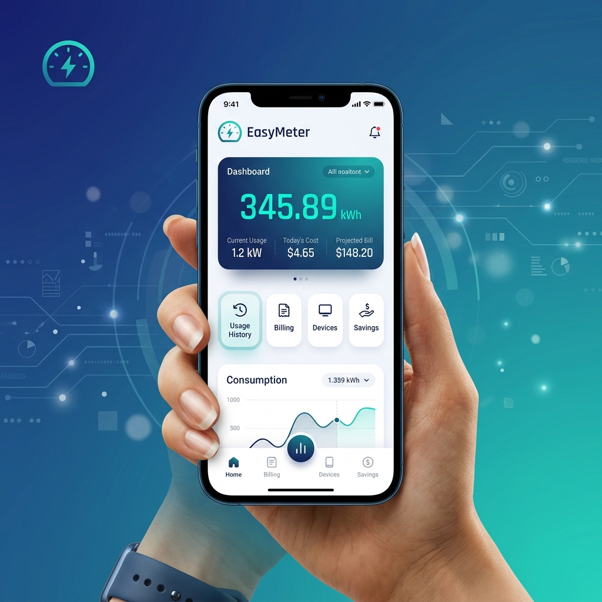
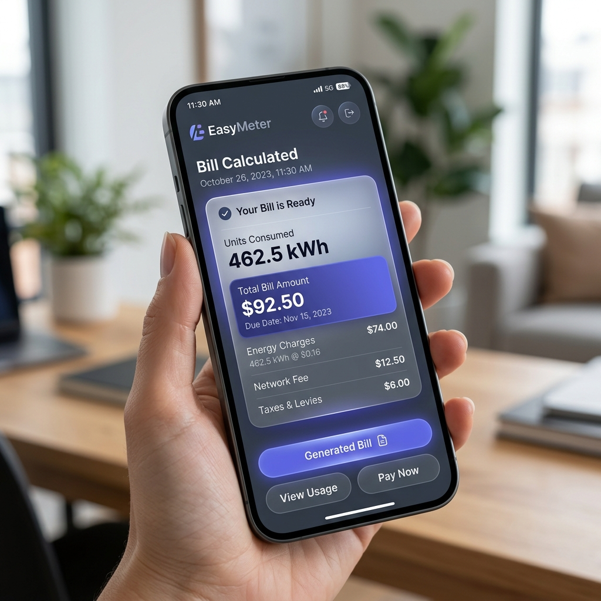

# ⚡ EasyMeter

[](https://github.com/salloju000/EasyMeter/blob/main/LICENSE)
[](https://github.com/salloju000/EasyMeter/stargazers)

**EasyMeter** is a modern, intuitive electricity billing application designed to automate sub-meter calculations. Built with precision and user experience in mind, it simplifies the complex task of calculating monthly bills based on meter readings.



---

## 🌟 Why I Built EasyMeter (The STAR Method)

### 📍 Situation
My house features a sub-metered unit that we have rented out to a tenant. Every month, I found myself drowning in manual calculations. I had to physically record the previous month’s reading, the current reading, calculate the difference, and then manually apply the slab rates for the electricity bill.

### 🎯 Task
The goal was to eliminate the error-prone and time-consuming process of manual "pen-and-paper" billing. I needed a reliable system that could store tenant history, handle dynamic electricity tariffs (like TSSPDCL/TGSPDCL), and generate professional-looking bills that could be shared instantly.

### ⚙️ Action
I developed **EasyMeter**, a full-featured web and mobile-ready application. 
- I implemented a robust core calculation engine that supports complex slab-based billing (including energy charges, customer charges, and duties).
- I used **Vite**, **React**, and **TypeScript** for a lightning-fast, type-safe frontend.
- I integrated **Capacitor** to ensure the app works seamlessly on Android devices.
- I added PDF and Image export functionality using **jspdf** and **html2canvas** for easy sharing.

### 🏆 Result
What used to be a 20-minute manual task now takes **less than 30 seconds**. EasyMeter has completely automated the billing process, providing 100% accuracy in calculations and a professional way to manage tenant relationships. 

---

## ✨ Features

- 📱 **Mobile Optimized**: Fully responsive UI built with Tailwind CSS and Radix UI.
- 🧮 **Precise Calculations**: Automatically handles TSSPDCL/TGSPDCL domestic billing structures.
- 📂 **Tenant Management**: Keep track of multiple tenants and their historical readings.
- 📄 **Professional Billing**: Generate and export bills as high-quality images or PDFs.
- 🌓 **Dark Mode**: Beautiful, system-aware dark and light modes.
- 🔄 **History Tracking**: View billing history at a glance with interactive charts.

---

## 🛠️ Tech Stack

- **Frontend**: [React](https://reactjs.org/) + [Vite](https://vitejs.dev/)
- **Language**: [TypeScript](https://www.typescriptlang.org/)
- **Styling**: [Tailwind CSS](https://tailwindcss.com/)
- **Components**: [Radix UI](https://www.radix-ui.com/) + [Shadcn UI](https://ui.shadcn.com/)
- **Mobile**: [Capacitor](https://capacitorjs.com/)
- **Forms**: [React Hook Form](https://react-hook-form.com/) + [Zod](https://zod.dev/)

---

## 📸 App Preview



---

## 🚀 Getting Started

### Prerequisites
- Node.js (v18+)
- npm or bun

### Installation

1. **Clone the repository**
   ```bash
   git clone https://github.com/salloju000/EasyMeter.git
   cd EasyMeter
   ```

2. **Install dependencies**
   ```bash
   npm install
   ```

3. **Start the development server**
   ```bash
   npm run dev
   ```

4. **Build for production**
   ```bash
   npm run build
   ```

---

## 📜 License

Created by [Salloju](https://github.com/salloju000). This project is intended for personal and educational use.

---

*“Turning manual math into a seamless digital experience.”* ⚡
